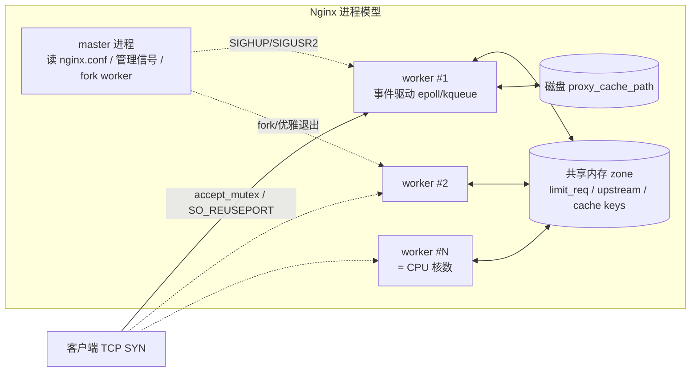
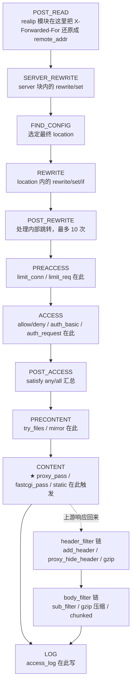
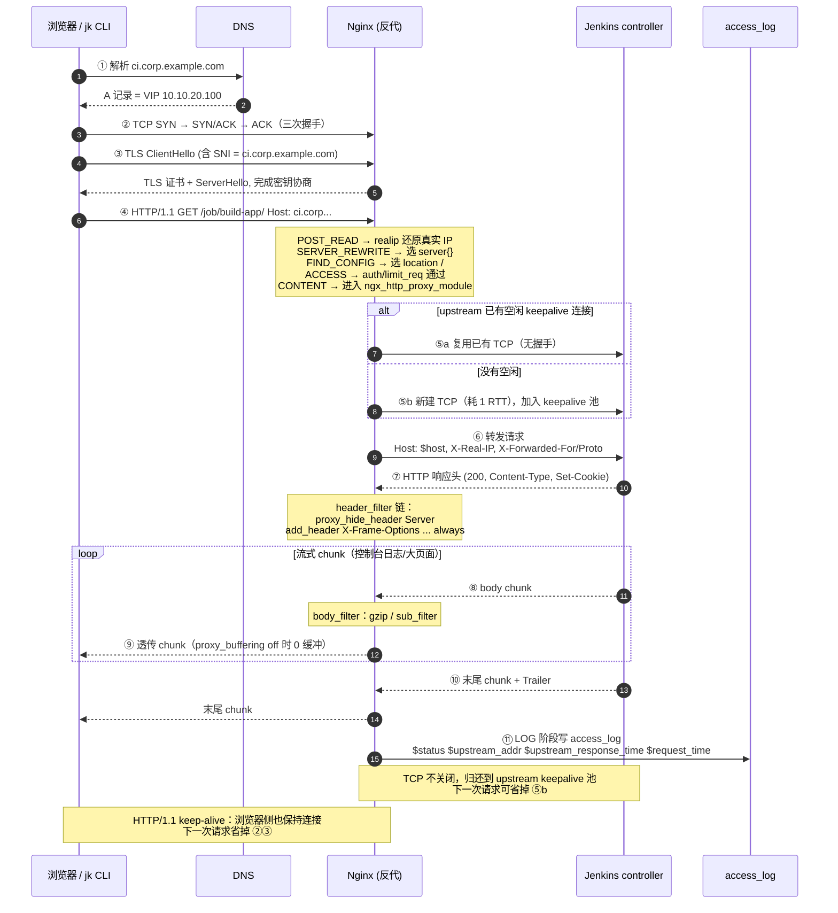
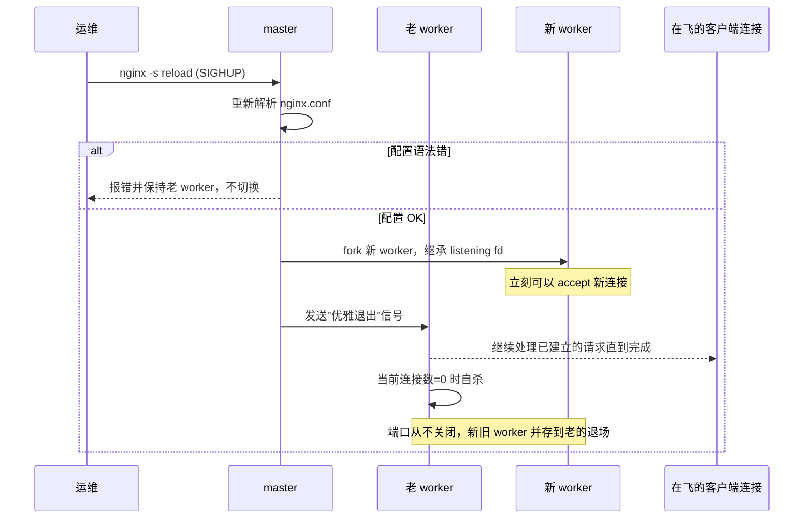

# VIP / 负载均衡 / 反向代理 快速入门

> 面向第一次接手平台部署的同学：**5 分钟读完、能看懂拓扑图、能和 SRE 对得上术语**。
> 想直接落地配置可继续看 [`deploy-idc-lan.md`](./deploy-idc-lan.md) 与 [`deploy-aliyun-ack.md`](./deploy-aliyun-ack.md)；本篇只讲概念和原理。
>
> 想专门深入 **Nginx 反向代理**（进程模型、11 个请求阶段、端到端时序、reload 不掉连接的原理）请直接跳到 [§7.1 Nginx 反向代理详解](#71-nginx-反向代理详解进程模型请求阶段时序)。

---

## 1. 一句话区分三个最容易混的词

| 名词 | 一句话定义 | 工作在哪一层 | 典型形态 |
|---|---|---|---|
| **VIP**（Virtual IP，虚拟 IP） | 一个**不绑定单台物理机**的 IP，可以在多台机器之间漂移 | L3（IP 层） | Keepalived/VRRP、云厂商 SLB 的前端 IP、K8s `LoadBalancer` Service 暴露的 IP |
| **LB**（Load Balancer，负载均衡） | 把流量按某种策略**分发到多个后端**的设备/服务 | L4（TCP/UDP）或 L7（HTTP）都可以 | LVS、HAProxy、F5、阿里云 SLB/CLB/NLB/ALB、Nginx、K8s Service |
| **反向代理**（Reverse Proxy） | **代表后端**接收客户端请求，再转发给真正的后端，并把响应回带 | L7（应用协议，最常见是 HTTP） | Nginx、Traefik、Envoy、Apache、Caddy、Ingress Controller |

**关系记忆口诀**：

> **VIP 是一个"地址"，LB 是一个"动作"，反向代理是 LB 的一种 L7 实现。**
> 三者经常**叠在一起出现**：VIP 指向 LB，LB 后面挂反向代理，反向代理再分发到 Jenkins。

---

## 2. 它们在 Jenkins 部署中分别解决什么问题

```
                    ┌───────── 问题 ─────────┐
   VIP        →    单点故障：LB 机器挂了客户端 DNS 不变也能切
   LB (L4)    →    并发/吞吐：把 TCP 连接分摊到多台
   反向代理 (L7) →  HTTPS 终结、Host 路由、鉴权、限流、改 header、缓存
                    └────────────────────────┘
```

具体到 `jenkins-cli` 项目：
- **`jk` CLI / 浏览器** 把请求发到一个稳定入口（VIP 或域名）。
- 入口背后是 **L4 LB / L7 反代**，做 TLS 终结 + 把流量打到 **Jenkins controller**（HA 时是 active-passive 一对，活动那台才接流量）。
- 反代会注入 `X-Forwarded-For` / `X-Forwarded-Proto`，让 Jenkins 能拿到真实客户端 IP 与原始 scheme。

---

## 3. 数据面的流向（从客户端到 Jenkins）

```
 jk / 浏览器
    │
    │ ① DNS 解析 ci.corp.example.com → VIP (10.10.20.100)
    ▼
 ┌──────────── VIP (虚拟 IP) ────────────┐
 │  漂在 LB-A / LB-B 两台机器之上        │   ← Keepalived/VRRP 或云厂商托管
 │  谁是 MASTER 谁就回应 ARP             │
 └──────────────────┬────────────────────┘
                    │ ② TCP 到达 LB
                    ▼
        ┌───── L4 LB （可选）─────┐
        │ 看 IP+端口，按四元组哈希 │   ← LVS / NLB / HAProxy(mode tcp)
        │ **不解 HTTP**            │
        └────────────┬─────────────┘
                     │ ③ TCP/TLS 转给反代
                     ▼
        ┌───── L7 反向代理 ──────┐
        │ TLS 终结、解 HTTP        │   ← Nginx / Ingress / Envoy
        │ 按 Host + path 路由      │
        │ proxy_set_header X-*     │
        └────────────┬─────────────┘
                     │ ④ HTTP（明文或 mTLS）
                     ▼
        ┌──── Jenkins controller ────┐
        │ active 节点处理 UI / API   │
        │ 把构建任务推给 agent       │
        └────────────────────────────┘
```

要点：
- **L4 LB 不看 HTTP**，所以它没法做"按 path 路由""注入 header""跳转 https"——这些必须 L7 反代来做。
- **VIP + L4 + L7** 三段不是必选三连，按规模剪裁：
  - PoC：客户端 → 单台 Nginx 反代 → Jenkins。
  - 中等：客户端 → VIP + Nginx（双机 keepalived）→ Jenkins。
  - 大规模：客户端 → 云 SLB（含 VIP+L4）→ Ingress Controller（L7）→ Jenkins。

---

## 4. VIP 是怎么"飘"起来的（L3 漂移原理）

最常见的两种实现：

### 4.1 Keepalived / VRRP（自建 IDC 用得最多）

- 两台 LB 机器组一对，配同一个 VIP `10.10.20.100`。
- 通过 VRRP 协议互相发**心跳**（默认每秒一次组播 224.0.0.18）。
- 优先级高的当 **MASTER**，它把 VIP 配到自己的网卡上并**主动发 GARP**（Gratuitous ARP）刷新交换机的 ARP 表，让局域网立刻知道 "VIP 现在指向我的 MAC"。
- MASTER 挂了，BACKUP 在心跳超时后接管 VIP，再发一次 GARP，**客户端连接会断一次但 DNS 不用改、IP 不用改**。

> 常见坑：交换机/云上禁了组播或不允许同 IP 漂移（云上自建 keepalived 通常**不可行**，必须用云的 SLB 替代）。

### 4.2 云厂商托管 LB 的"VIP"

- 阿里云 SLB / AWS NLB / K8s `Service: LoadBalancer` 给你一个 EIP，本质上也是 VIP，只是漂移逻辑被云平台用 SDN/ECMP 实现，对你透明。
- 你**不要再在前面套 keepalived**，会和云的健康检查打架。

---

## 5. L4 vs L7：到底差在哪

| 维度 | L4 LB | L7 反向代理 |
|---|---|---|
| 看到的内容 | IP、端口、TCP/UDP | HTTP method/host/path/header/body、TLS SNI |
| 能否 TLS 终结 | ❌ 一般不解（也有 TLS passthrough） | ✅ 终结后明文转后端，或再起 mTLS |
| 路由能力 | 仅按四元组/SNI 分发 | 按 Host、path、header、cookie 路由 |
| 改写能力 | 无（连接级） | 改 header、改 URI、压缩、缓存、限流 |
| 性能 | 极高（DR/FullNAT，单机百万 QPS 没问题） | 高，但比 L4 低一个量级 |
| 典型实现 | LVS、IPVS、NLB、HAProxy(mode tcp) | Nginx、Envoy、Traefik、ALB |

**记忆**：L4 像快递分拣中心（只看地址条），L7 像前台秘书（拆开看完内容再决定送谁）。

---

## 6. 反向代理 vs 正向代理（顺手澄清）

```
正向代理：客户端 → [代理] → 互联网          ← 代理"代表客户端"，常见：公司出口代理、VPN 出口
反向代理：客户端 → [代理] → 内部服务         ← 代理"代表服务端"，常见：Nginx 挡 Jenkins
```

判断依据：**代理是替谁出面**？
- 隐藏客户端身份去访问外网 → 正向代理。
- 隐藏后端拓扑、统一入口给客户端 → 反向代理。

---

## 7. Nginx 反向代理"为什么生效"——精简版

> 完整原理在网上有大量长文，这里只挑你看部署文档时一定会遇到的点。

1. **配置加载**：`nginx -s reload` 让 master 重新解析 `nginx.conf` → 启动新 worker、老 worker 处理完存量请求再退出，**端口不空窗、连接不抖动**。
2. **请求匹配**：`listen` + SNI/`Host` 选 `server{}`，再按 `=` → `^~` → 正则 → 最长前缀的优先级选 `location{}`。
3. **`proxy_pass` 在 CONTENT 阶段触发**，由 `ngx_http_proxy_module` 接管：选 upstream peer → 改写 header → 建连/复用 keepalive → 流式双向转发 → 改写响应 header。
4. **必配 4 行**（少一行就出怪事）：
   ```nginx
   proxy_set_header Host              $host;
   proxy_set_header X-Real-IP         $remote_addr;
   proxy_set_header X-Forwarded-For   $proxy_add_x_forwarded_for;
   proxy_set_header X-Forwarded-Proto $scheme;
   ```
5. **upstream keepalive 三件套**（漏一个就回退到短连接，QPS 暴跌）：
   ```nginx
   upstream jenkins { server 10.0.1.10:8080; keepalive 32; }
   proxy_http_version 1.1;
   proxy_set_header Connection "";
   ```
6. **Jenkins 特有注意点**：
   - 控制台日志 / SSE / WebSocket（如内嵌 agent 的 WebSocket 接入、`jenkins-cli.jar -webSocket` 等长连接路径）需要 `proxy_buffering off;` + 较大的 `proxy_read_timeout`（如 `1h`），否则长任务会被截断。具体路径以你 Jenkins 版本与插件实际暴露的为准。
   - WebSocket 还需：
     ```nginx
     proxy_set_header Upgrade    $http_upgrade;
     proxy_set_header Connection $connection_upgrade;
     ```
   - `proxy_pass` 末尾**带不带 `/`** 决定 URI 是否被剥前缀，写错就 404。
7. **排查神器**：access log 加上 `$upstream_addr $upstream_status $upstream_response_time $request_time`，立刻能定位"慢在客户端还是慢在 Jenkins""有没有触发 next_upstream 重试"。

---

## 7.1 Nginx 反向代理详解：进程模型、请求阶段、时序

> 上一节是"必背速记卡"，这一节是"原理图鉴"。看完能在脑子里把 *客户端按下回车* 到 *Jenkins 返回 HTML* 的每一跳都画出来。

### 7.1.1 进程模型（master / worker / 共享内存）



要点：
- **master 不处理请求**，只读配置、管子进程、收信号（`reload`、`reopen`、`upgrade`）。
- **worker 单线程 + 非阻塞 I/O**，一个 worker 同时扛上万连接靠的是 epoll，不是多线程。
- **共享内存 zone** 让所有 worker 共享 upstream 健康状态、限流计数、缓存索引——所以你 `limit_req_zone` 写一次就对全机生效。
- **`reload` 平滑原理**：master 收到 `SIGHUP` → 用新配置 fork 出新 worker 接管 listening socket → 老 worker 处理完存量连接后自杀，**端口从不空窗**。

### 7.1.2 单个 HTTP 请求在 worker 内部走的 11 个阶段

Nginx 把一个请求拆成 11 个 *phase*，每个模块挂在对应 phase 上。理解这张图你就知道为什么 `auth_request` 早于 `proxy_pass`、为什么 `add_header` 改不到上游响应。



记忆抓手：
- **`auth_request` 永远先于 `proxy_pass`** —— 因为 ACCESS 在 CONTENT 之前。
- **`add_header` 默认只对自己产生的响应生效**，要改上游响应里的 header 用 `proxy_hide_header` + `add_header`，并加 `always`。
- **`limit_req` 触发的 503 不会经过 upstream**，因为请求在 PREACCESS 就被毙了——所以你在 access log 里看不到 `$upstream_addr`。

### 7.1.3 反向代理的端到端时序图（HTTPS + keepalive + Jenkins）

下图覆盖 *DNS → TLS 握手 → Nginx 11 阶段 → upstream 复用连接 → 流式响应 → 长连接保留* 全链路：



### 7.1.4 不同"阶段视角"的对照速查表

不同人讲"Nginx 反向代理的阶段"经常指不同维度，下面把三种视角并排放，看部署文档时对得上号：

| 维度 | 阶段 | 触发点 / 关键指令 | 你能干的事 |
|---|---|---|---|
| **生命周期** | 1. 启动加载 | `nginx -t` / `nginx -s reload` | 校验语法、热更配置 |
|  | 2. 接受连接 | `accept_mutex` / `reuseport` | 控制惊群、绑核 |
|  | 3. TLS 握手 | `ssl_protocols` / `ssl_session_cache` | TLS 版本/会话复用/OCSP stapling |
|  | 4. 请求处理 | 11 phase（见 7.1.2） | 鉴权、限流、改写 |
|  | 5. 上游通信 | `proxy_pass` / `upstream` | 选后端、健康检查、重试 |
|  | 6. 响应回写 | header/body filter | 改 header、压缩、替换内容 |
|  | 7. 日志收尾 | `access_log` / `log_format` | 打点、链路追踪 |
| **请求处理 11 phase** | POST_READ → LOG | 见 7.1.2 流程图 | 模块挂载点 |
| **代理子流程** | a. 选 peer | `upstream` + `least_conn` / `hash` | 负载策略 |
|  | b. 建连/复用 | `keepalive N` + `proxy_http_version 1.1` | 长连接池 |
|  | c. 写请求 | `proxy_set_header` / `proxy_pass_request_body` | 改请求 |
|  | d. 读响应头 | `proxy_read_timeout` 第一字节 | 超时分级 |
|  | e. 流式转发 body | `proxy_buffering` on/off | 缓冲 vs 透传 |
|  | f. 错误重试 | `proxy_next_upstream` | 幂等重试范围 |
|  | g. 释放/归还 | keepalive 池 | 复用 TCP |

### 7.1.5 一次 `reload` 的时序（为什么不掉连接）



对比：**keepalived 切 VIP** 是 L3/ARP 层的硬切，已建立的 TCP 连接会失效；**Nginx reload** 是同主机进程交接 listening socket，**不会断已建立的连接**。

### 7.1.6 把以上落到一段最小可用的 Jenkins 反代配置

```nginx
# /etc/nginx/conf.d/jenkins.conf
map $http_upgrade $connection_upgrade { default upgrade; '' close; }

upstream jenkins {
    server 10.0.1.10:8080 max_fails=3 fail_timeout=10s;
    keepalive 32;                       # ← 7.1.3 ⑤a 能复用连接
}

server {
    listen 443 ssl http2;
    server_name ci.corp.example.com;

    ssl_certificate     /etc/nginx/ssl/ci.crt;
    ssl_certificate_key /etc/nginx/ssl/ci.key;

    # ---- 11 phase 中的 SERVER 级公共设置 ----
    client_max_body_size 100m;          # 允许上传插件/构建产物
    proxy_http_version   1.1;
    proxy_set_header     Connection         "";          # ← keepalive 三件套
    proxy_set_header     Host               $host;
    proxy_set_header     X-Real-IP          $remote_addr;
    proxy_set_header     X-Forwarded-For    $proxy_add_x_forwarded_for;
    proxy_set_header     X-Forwarded-Proto  $scheme;

    # ---- CONTENT phase：交给 upstream ----
    location / {
        proxy_pass         http://jenkins;
        proxy_redirect     default;
        proxy_read_timeout 1h;          # 控制台日志/长任务
        proxy_buffering    on;          # 一般页面开缓冲
    }

    # 控制台日志/SSE/WebSocket：关闭缓冲 + 升级协议
    location ~* ^/(.*/(logText/progressiveHtml|logText/progressiveText)|cli|wsagents) {
        proxy_pass            http://jenkins;
        proxy_buffering       off;      # 流式直出，对应 7.1.3 loop ⑨
        proxy_request_buffering off;
        proxy_set_header      Upgrade    $http_upgrade;
        proxy_set_header      Connection $connection_upgrade;
        proxy_read_timeout    1h;
        proxy_send_timeout    1h;
    }

    # 把 7 个变量都打出来，排障必备
    log_format jenkins '$remote_addr $host "$request" $status '
                      '$body_bytes_sent rt=$request_time '
                      'urt=$upstream_response_time ua="$upstream_addr" '
                      'us=$upstream_status';
    access_log /var/log/nginx/jenkins.access.log jenkins;
}
```

> 这段配置每一行都能对应到 7.1.1–7.1.5 的某张图，建议把它和图对照着读一遍——以后再看 [`deploy-idc-lan.md`](./deploy-idc-lan.md) / [`deploy-aliyun-ack.md`](./deploy-aliyun-ack.md) 中的实际片段就完全无障碍。

---

## 8. 一张组合速查表（对照本仓部署方案）

| 部署形态 | VIP 由谁提供 | L4 由谁做 | L7 反代 / Ingress | TLS 终结点 |
|---|---|---|---|---|
| 单机 PoC | 无（直接用主机 IP/域名） | 无 | 主机上的 Nginx | Nginx |
| IDC 双机 HA（[deploy-idc-lan](./deploy-idc-lan.md)） | Keepalived/VRRP | Nginx 同机做（stream 模块）或纯 L7 | Nginx | Nginx |
| 阿里云 ACK（[deploy-aliyun-ack](./deploy-aliyun-ack.md)） | 阿里云 SLB | SLB（NLB / CLB-TCP） | Ingress-Nginx / ALB Ingress | SLB 或 Ingress 二选一，看是否要在 Pod 看到 mTLS |

---

## 9. 看完这篇你应该能回答

- 为什么 `jk` 配置里建议写**域名**而不是 VIP？→ 见 [`faq.md` Q1](./faq.md)。VIP 可能因网络方案变化，域名是更稳定的间接层。
- 为什么 reload Nginx 不会断流，而 keepalived 切换 VIP 会断一次连接？→ 前者复用 listening socket，后者是 L3 层 ARP 切换，已建立的 TCP 连接随旧 MASTER 一起没了。
- 为什么 Jenkins 控制台日志在浏览器里"卡一大段才出来"？→ 反代默认 `proxy_buffering on`，要为日志/SSE 关掉。
- 为什么后端日志里看到的客户端 IP 全是反代的 IP？→ 反代没传 `X-Forwarded-For`，或 Jenkins 没启用 `Forwarded` header 解析（`Manage Jenkins → Configure Global Security → "Use Forwarded Header"`）。

---

## 10. 延伸阅读（仓内）

- [`topology.md`](./topology.md) — 看到本篇术语后再读拓扑图会顺很多。
- [`design.md`](./design.md) — HA、备份、合规设计选择。
- [`deploy-idc-lan.md`](./deploy-idc-lan.md) — keepalived + Nginx 的实际配置片段。
- [`deploy-aliyun-ack.md`](./deploy-aliyun-ack.md) — 云上 SLB + Ingress 的具体做法。
- [`checklist.md`](./checklist.md) — 上线前把本篇提到的"必配 4 行 / keepalive 三件套 / WebSocket / X-Forwarded-*"逐项核对。
